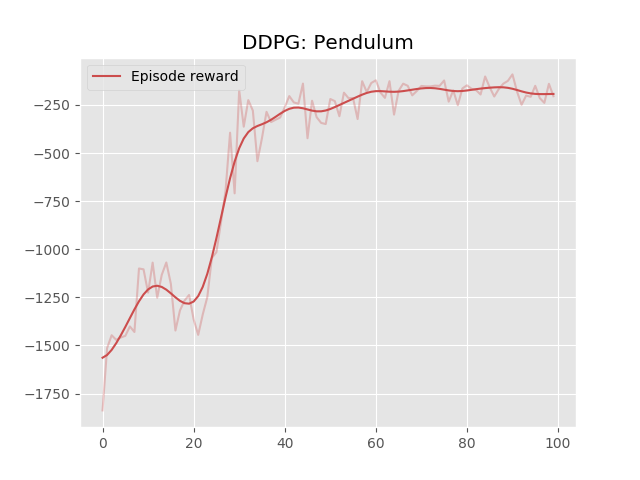

# Off policy RL algorithms 

This repo holds implementations of various off-policy algorithms. 
Currently there is: 

* DPPG
* SAC (WIP) 
* TD3(WIP)

## DDPG

Currently, only on `Pendulum-v0`. I plan on adding a more flexible version, more suited to other environments. 

### Some results: 

